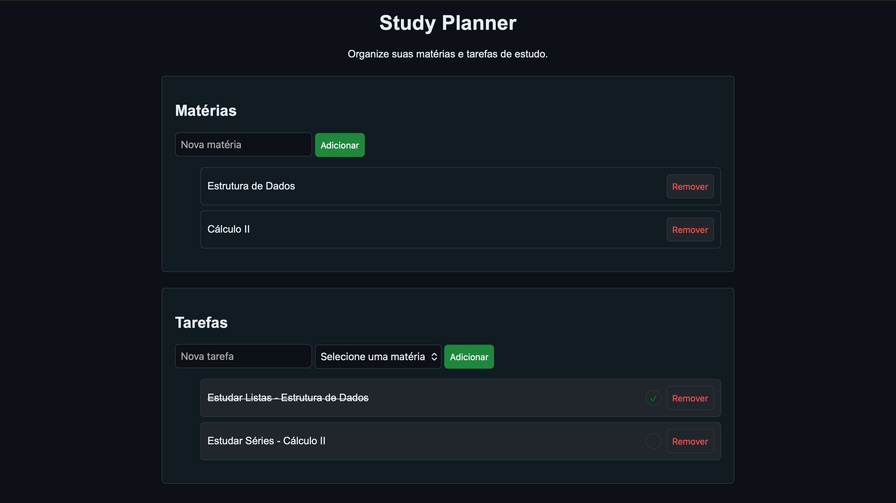

# Study Planner

## Sobre o site

Site de planejamento dos estudos desenvolvido com o intuito de praticar e aprimorar meus conhecimentos em JavaScript, HTML e CSS.

O site permite adicionar e excluir matérias e tarefas, associar tarefas às matérias e marcá-las como concluídas.

Além disso, foi utilizado LocalStorage para que as informações permaneçam salvas mesmo após fechar ou recarregar a página.

## Prévia do site

## Como acessar o site

🔗 **[Acessar o Study Planner](https://lucasbfonte.github.io/ProjetoWeb/)**

Ou abra o arquivo `index.html` em um navegador
